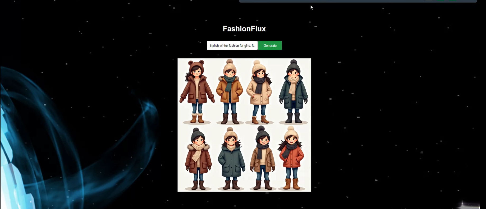

# Flask-API-for-Flux-text-to-image-generation
I created a Flask API for text-to-image generation using a pre-trained Flux model in this project. The API has a simple endpoint where users can send text prompts. The model takes the prompt and generates an image based on it. Users can easily access this API to create pictures by just sending their text inputs. This makes it user-friendly for anyone wanting to quickly generate images from text.

## Resul

  

## Demo Video
<video width="600" controls>
  <source src="FashionFlux_project.mp4" type="video/mp4">
</video>
